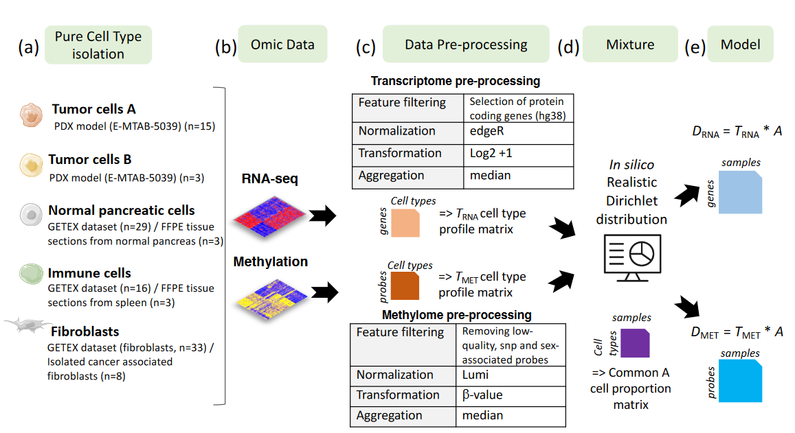

(a) 5 different cell populations present in pancreatic tumors were considered. 
(b) Raw transcriptome and methylome profiles of these different cell populations were extracted from various sources (PDX model, tissues or isolated cells). 
(c) Raw cell type profile matrices were preprocessed (Feature filtering, normalization, signal transformation, sample aggregation) to avoid any batch effect. 
(d) In silico Dirichlet distribution have been used based on realistic proportions defined by the anatomopathologist expertise (J. Cros). 
(e) Paired methylome and transcriptome of in silico mixtures from pancreatic tumors were obtained by considering D = T A, with T the cell-type profiles (matrix of size M \* K, with M the number of features and K=5 the number of cell types) and A the cell-type proportion per patient (matrix of size K \* N, with N=30 the number of samples) common between both omics.  

More details in our [article](https://www.biorxiv.org/content/10.1101/2020.06.06.131482v1)

