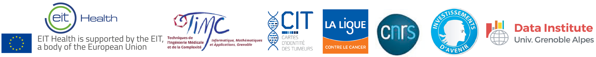

This work has been supported by EIT Health in the context of the european project COMETH ([know more](https://cancer-heterogeneity.github.io/cometh.html)) leaded by Magali Richard and Yuna Blum.  

 
 
HADACA Consortium contributed to this work by proposing and implementing the baseline reference methods.

### HADACA Consortium
Nicolas Alcala6, Alexis Arnaud2, Francisco Avila Cobos7, Luciana Batista8, Anne-Françoise Batto9, Yuna Blum3, Florent Chuffart10, Jérôme Cros5, Clémentine Decamps1, Lara Dirian11, Daria Doncevic12, Ghislain Durif13, Silvia Yahel Bahena Hernandez14, Milan Jakobi10, Rémy Jardillier15, Marine Jeanmougin16, Pau Jedynak10, Basile Jumentier1, Aliaksandra Kakoichankava17, Maria Kondili18, Jing Liu19, Tiago Maie20, Jules Marécaille11, Jane Merlevede21, Maxime Meylan3,22, Petr Nazarov23, Kapil Newar1, Karl Nyrén14, Florent Petitprez3, Claudio Novella Rausell14, Magali Richard1, Michael Scherer24, Nicolas Sompairac21, Katharina Waury14, Ting Xie25 & Markella-Achilleia Zacharouli14

#### Affiliations 

1 Laboratory TIMC-IMAG, UMR 5525, Univ. Grenoble Alpes, CNRS, Grenoble, France.  
2 Data Institute, Univ. Grenoble Alpes, Grenoble,
France.  
3 Programme Cartes d’Identité des Tumeurs (CIT), Ligue Nationale Contre le Cancer, Paris, France.  
4 INSERM U1068 CRCM, Marseille, France.   
5 Beaujon Hospital, Dpt of Pathology - Univ. Paris-INSERM U1149; Clichy, France.  
6 Section of Genetics, International Agency for Research on Cancer (IARC-WHO), Lyon, France  
7 Center  for  Medical  Genetics  Ghent,  Department  of  Biomolecular  Medicine,  Ghent University,  Ghent,  Belgium.  
8 Innate Pharma, Marseille, France  
9 Equipe Cancer et Immunité- INSERM Centre de Recherche des Cordeliers, Paris, France  
10 Institute for Advanced Biosciences, CNRS UMR 5309, Inserm, U1209, Univ. Grenoble Alpes, F-38700 Grenoble, France  
11 Verteego, Paris, France  
12 Health Data Science Unit, BioQuant Center and Medical Faculty Heidelberg  
13 Université de Montpellier, CNRS, IMAG UMR 5149, Montpellier, France
14 Uppsala University, SE-751 05, Uppsala, Sweden  
15 University Grenoble Alpes, CEA, INSERM, IRIG, Biology of Cancer Infection UMR_S 1036, 38000 Grenoble, France & University Grenoble Alpes, CNRS, Grenoble INP, GIPSA-lab, Institute of Engineering University Grenoble Alpes, 38000 Grenoble, France  
16 Department of Molecular Oncology, Institute for Cancer Research, Oslo University Hospital, The Norwegian Radium Hospital - Oslo, Norway  
17 Vitebsk State Medical University & NatiVita, Vitebsk, Belarus  
18 Centre de Recherche de St.Antoine,Paris, AP-HP  
19 Institut Curie, PSL Research University, Sorbonne Universités, UPMC Université Paris 06, CNRS, UMR144, Equipe Labellisée Ligue contre le Cancer, 75005 Paris, France  
20 Institute for Computational Genomics, Joint Research Center for Computational Biomedicine, RWTH Aachen University Medical School, Aachen, Germany  
21 Institut Curie, PSL Research University, Mines Paris Tech, Inserm, U900, F−75005, Paris, France  
22 INSERM U1138 Centre de Recherche des Cordeliers, France  
23 Quantitative Biology Unit, Luxembourg Institute of Health, L-1445 Strassen, Luxembourg  
24 Department of Genetics/Epigenetics, Saarland University, Saarbrücken, Germany  
25 Centre de Recherche en Cancérologie de Toulouse, Inserm  UMR  1037, F-31037, Toulouse, France  

