<br>

Our platform is hosted on a Linux operating system supporting standard singularities or containers. The benchmark is structured around an ingestion program used as a wrapper object to execute an R program. Should anyone wish to benchmark a method coded in another language, R could then be used as script language to execute the given program by invoking a System Command. Required additional languages or libraries can be installed on our Docker image upon request ([resources webpage](https://deconbench.github.io/Resource.html)).  


{width=30%}

##Demo video
This video shows how to use the benchmarking platform:  
<video width="640" height="480" controls>
  <source src="Demo_with_subtitles.mp4" type="video/mp4">
</video>

<br>


##Step 1: go on Deconbench  

You can directly access the platform from [this link]( https://competitions.codalab.org/competitions/27453?secret_key=b5ae4e78-8e75-44a4-b919-52907529605c).  
Or you can search the platform from Codalab:
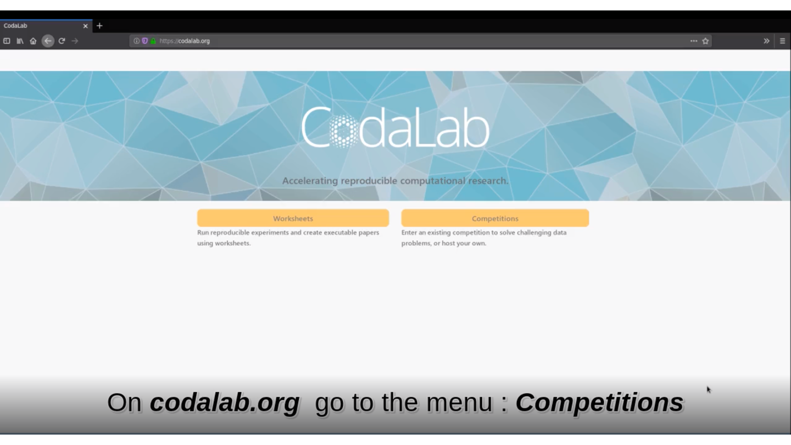{width=70%}

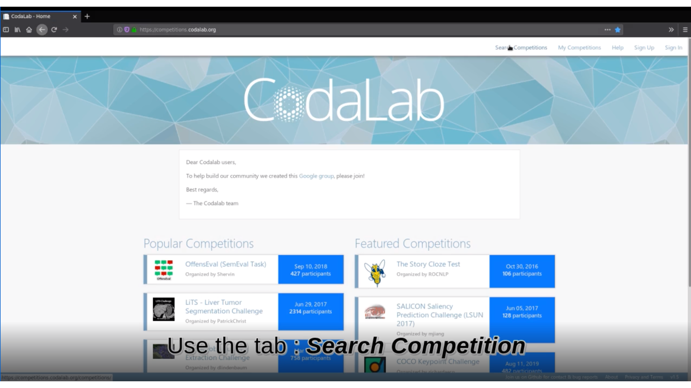{width=70%}

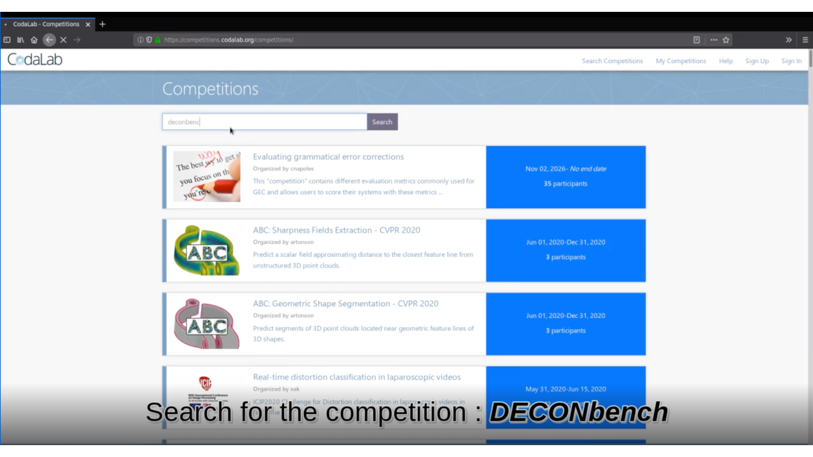{width=70%}

<br>

##Step 2: Participate by adding a novel method  

First you need to create an account:

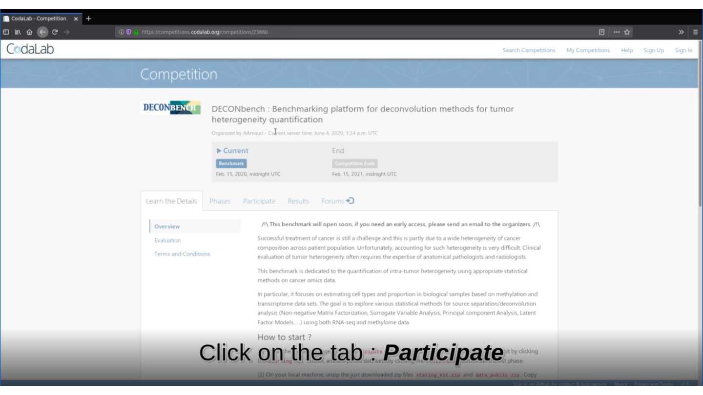{width=70%}

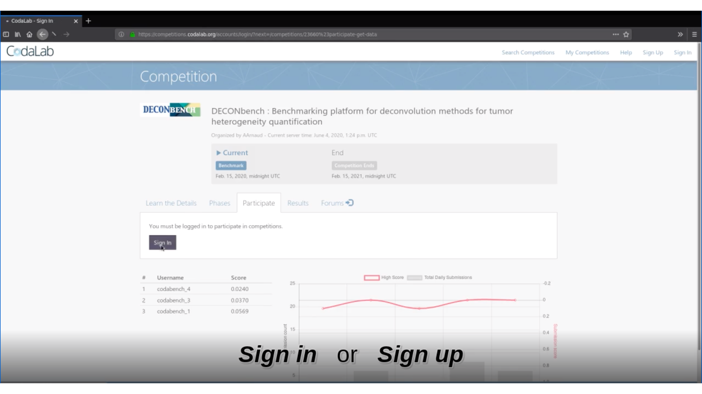{width=70%}

{width=70%}
<br>

Then, you will be able to download the necessary files:   **stating_kit.zip** and **data_public.zip** that are in the Participate tab>Files item.  

On your local machine, unzip the two zip files stating_kit.zip and data_public.zip. Copy the data sets (D_met1_public.rds, D_rna1_public.rds, A_1_public.rds) into the unziped starting_kit directory.  
Then open R from the starting_kit directory, (e.g. open strating_kit.Rmd with RStudio).

The unziped strating-kit directory contains now:  
- A **starting_kit.html** corresponding to the vignette of the Benchmark (all useful information can be found here).  
- A **submission_script.Rmd** to modify and to use to submit your code.  
- The methylation and transcriptome D matrices, and the associated A matrix. 

In the R console launch the following command:  
```
rmarkdown::render(input = "submission_script.Rmd")
```
**This command line will create the zip file you need to submit your method on Deconbench!**  
You are alsmost there!😄


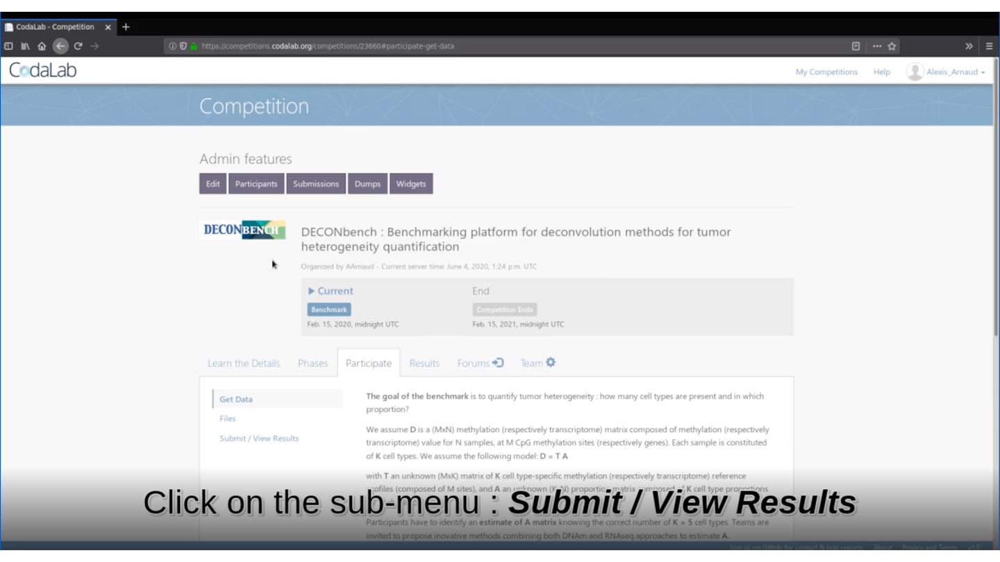{width=70%}

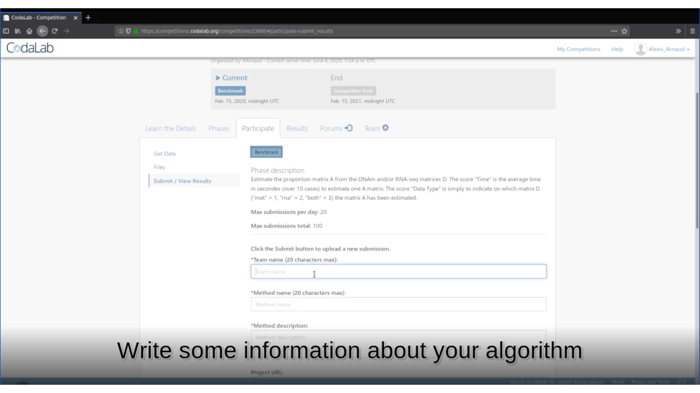{width=70%}

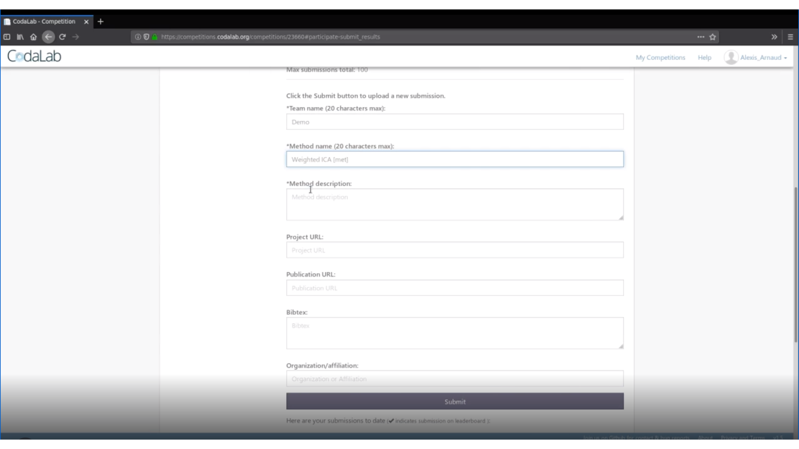{width=70%}

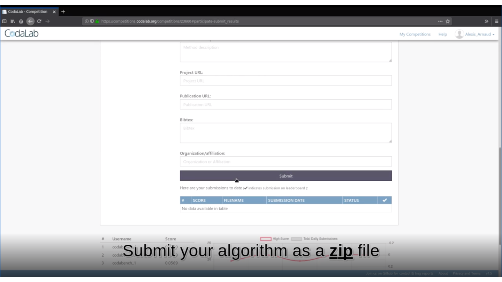{width=70%}

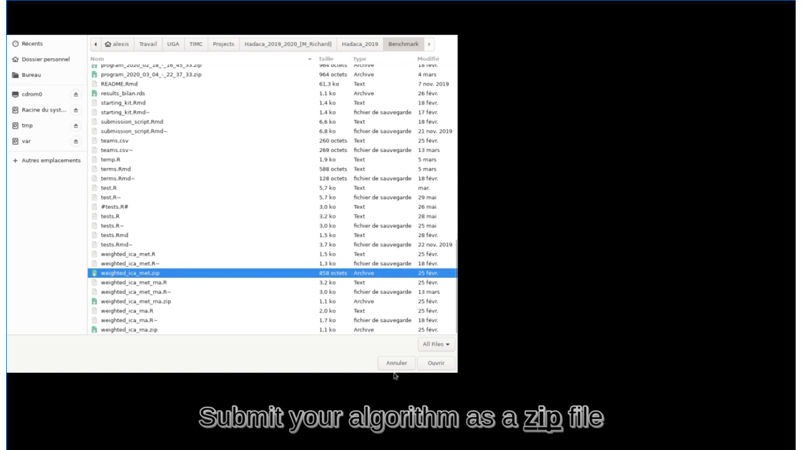{width=70%}

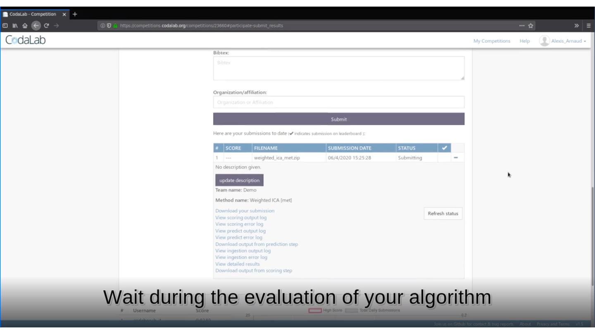{width=70%}

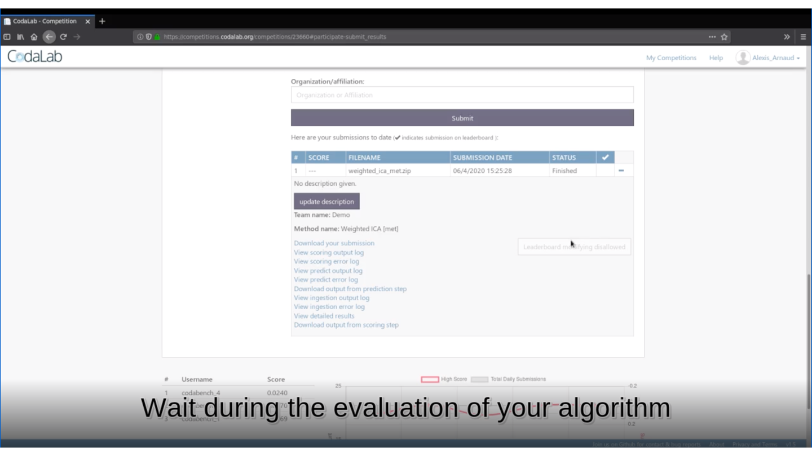{width=70%}

<br>

##Step 3: View the results and performance of your method  

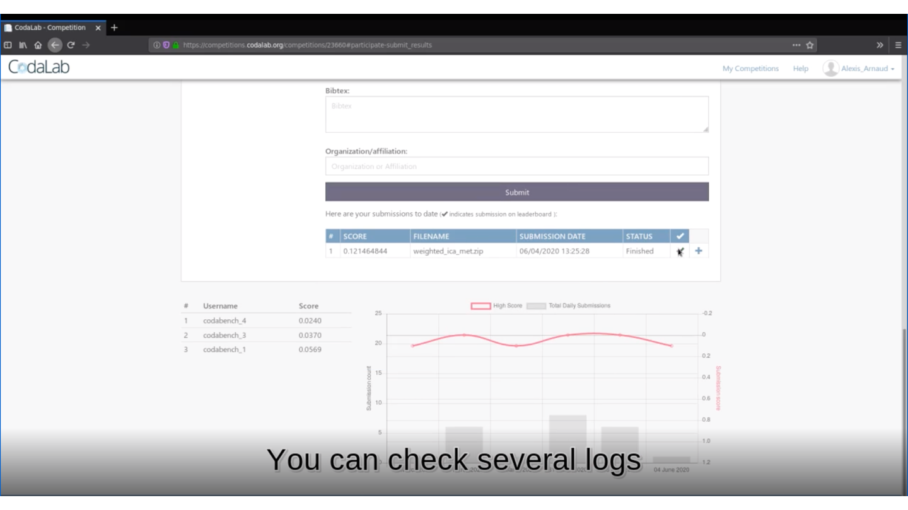{width=70%}
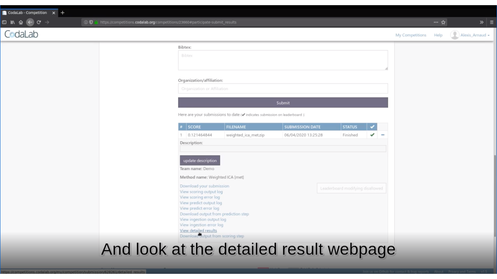{width=70%}
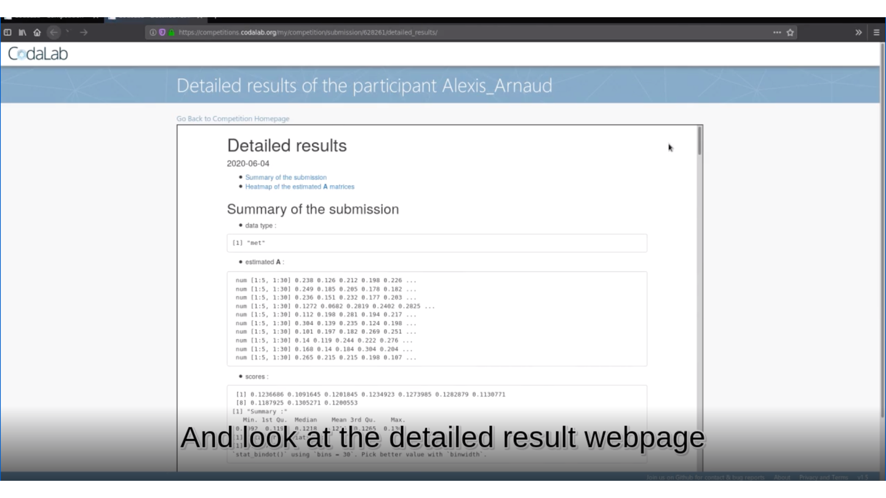{width=70%}
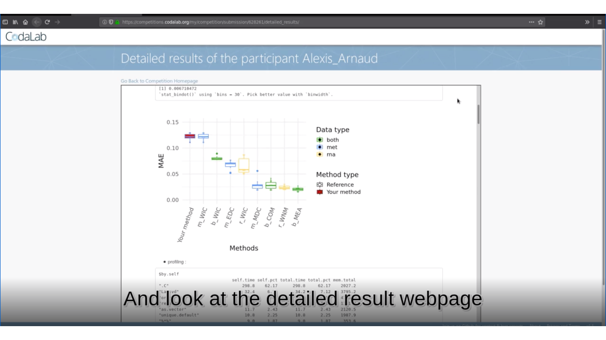{width=70%}
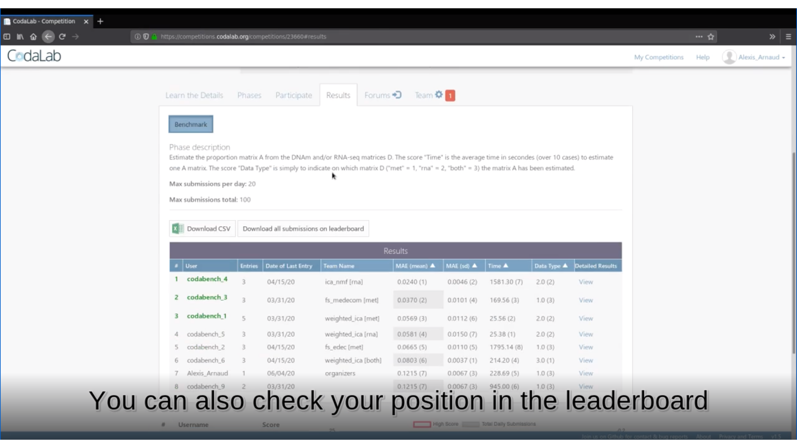{width=70%}

<font size="4"> 🏆 Is your method the best one? </font> 

